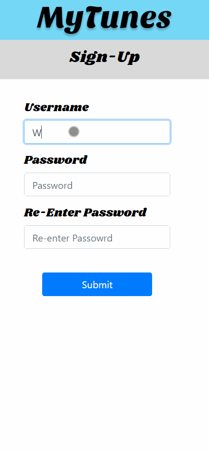
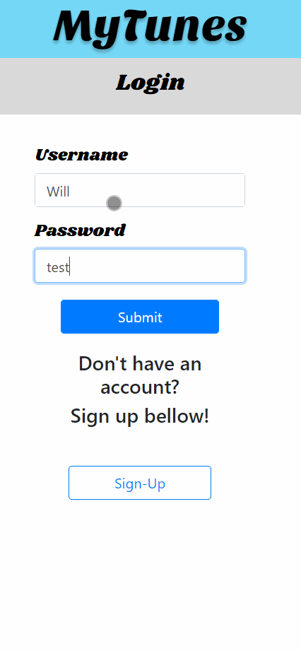
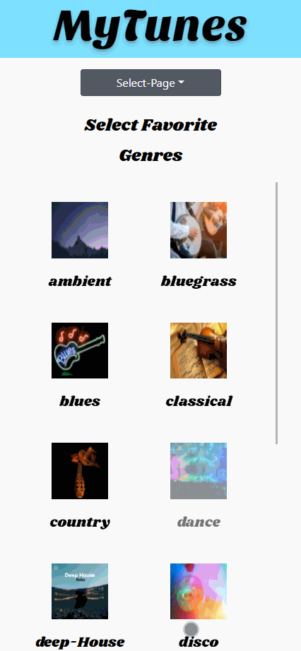
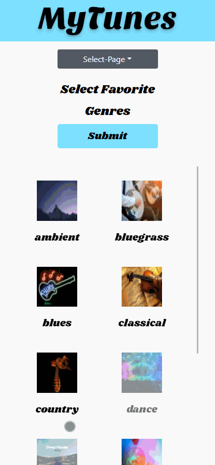
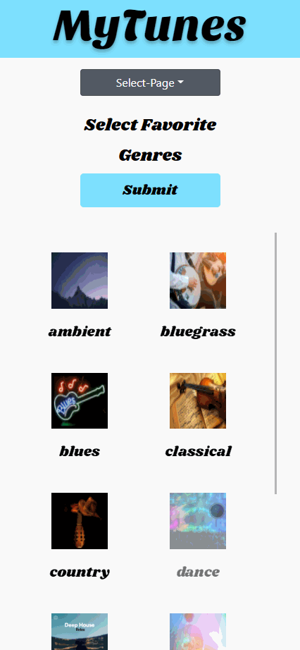
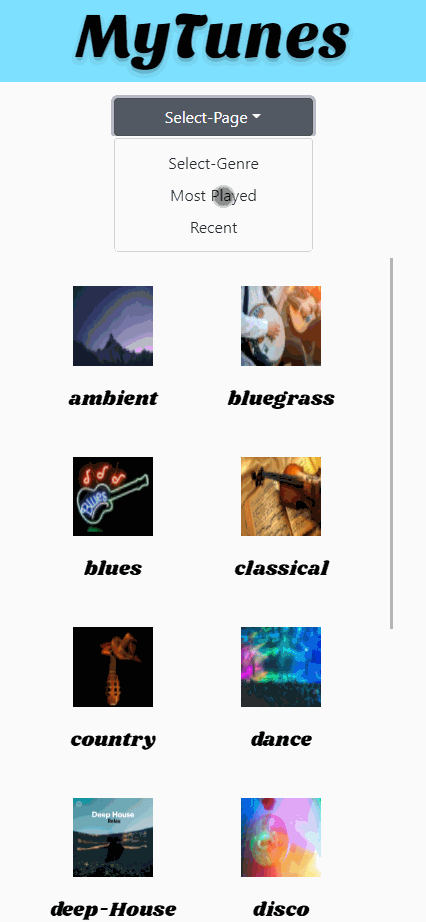

# MyTunes 
---
 A web application that shows your top played songs and helps find new music!

## live Demo
>[mytunes.keatonkrieger.com](https://mytunes.keatonkrieger.com/)

## Technologies Used
---
- React.Js
- Node.Js
- React Redux
- React Router
- Express
- Postgresql
- AWS EC2
- Postgresql

## API's Used
---
- Spotify Api
- Youtube Api

## Features
---
- Users can sign-up
- Users can login
- Users can connect to spotify api
- Users can search for reccomended music based on favorite category and favorite music
- Users can watch reccomended songs via youtube api
- Users can add song to spotify playlist
- Users can like song on spotify via app
- Users can view most played songs
- Users can view most recent songs

## Preview
---
>Sign-up

> ---
>Login

> ---
>Users can connect to spotify api

> ---
>Users can search for reccomended music based on favorite category and favorite music

> ---
>Users can watch reccomended songs via youtube api

> ---
>Users can add song to spotify playlist

> ---
>Users can view most played songs

> ---
>Users can view most recent songs

> ---
